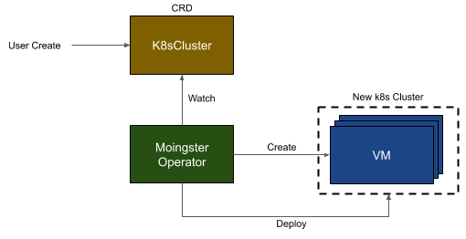

# Moingster 디자인 문서
Moingster는 Kubernetes as a Service(KaaS)를 베어메탈에서 제공합니다. 핵심 기능은 다음과 같습니다.

- k8s cluster를 k8s resource(CRD)로 관리
- k8s cluster가 생성되기 위한 VM을 베어메탈에 직접 생성하고 관리
- RKE등의 엔진 없이 오리지날 Kubernetes를 설치

아래와 같은 장점을 갖습니다.

- 직접 VM을 관리하기 때문에 별개의 IaaS 서비스나 오픈스택등의 운영이 필요하지 않습니다.
- 클러스터를 CRD로 제공하기 때문에 클러스터 관리를 위해 별도의 방법이 필요하지 않습니다.
- 오리지널 Kubernetes를 변경 없이 설치하기 때문에 모든 Kubernetes 기능을 그대로 사용할 수 있습니다.


## Moingster 사용자 시나리오
### 새로운 k8s cluster 생성



1. 사용자는 CRD로 정의된 `K8sCluster` 객체를 생성합니다.
2. Moingster Operator는 해당 객체의 변화를 감지하고 새로운 클러스터를 생성합니다.
3. 관리용 Kubernetes 클러스터 내에 Kubevirt에 의해 새로운 VM들이 생성됩니다.
4. 해당 VM들에 접근하여 Kubernetes를 설치합니다.


## CRD
### k8sCluster
```
kind: K8sCluster
Spec:
  kubernetes:
    version: v1.17.4
    networkProvider: Canal
  nodes:
    master: 3
    worker: 3
    allowMasterWorkerSameNode: true
    nodeSpec:
      cpu:
        cores: 2
      resources:
        requests:
          memory: 1024M
```
